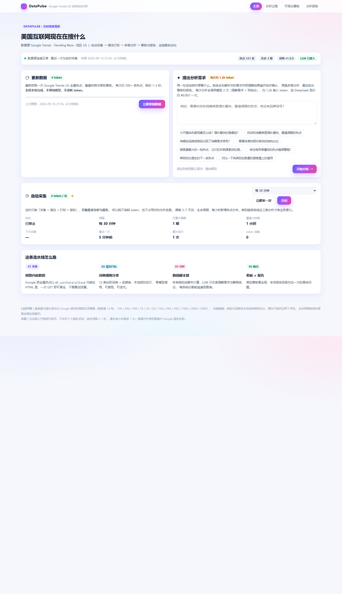
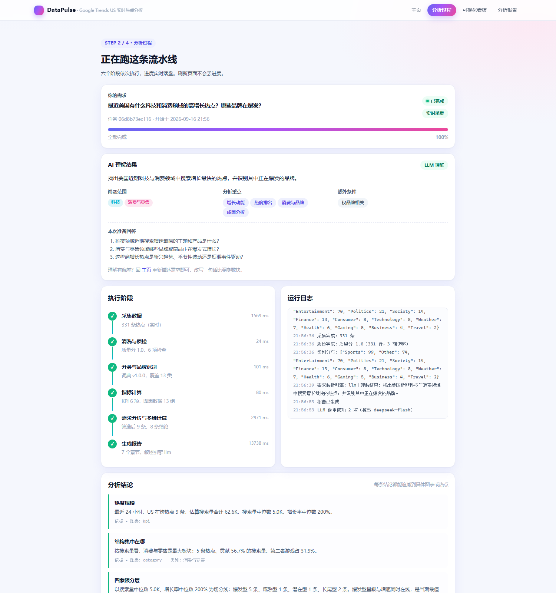
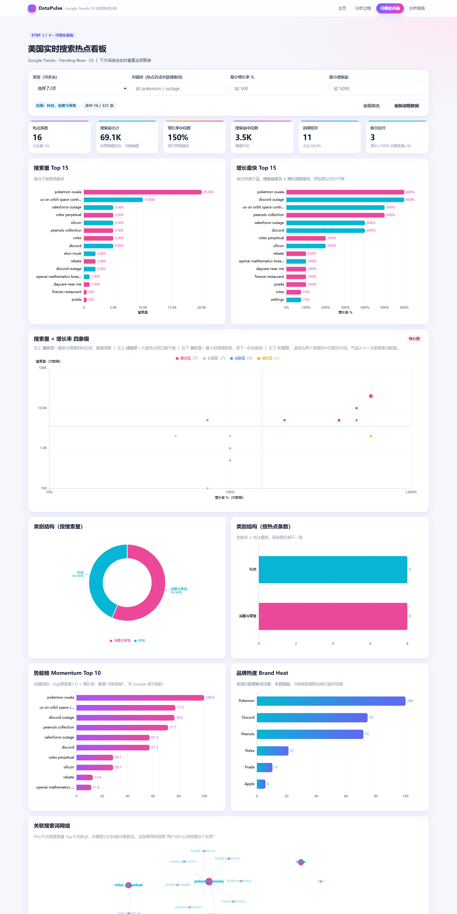
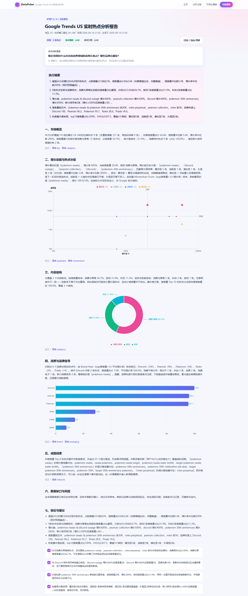
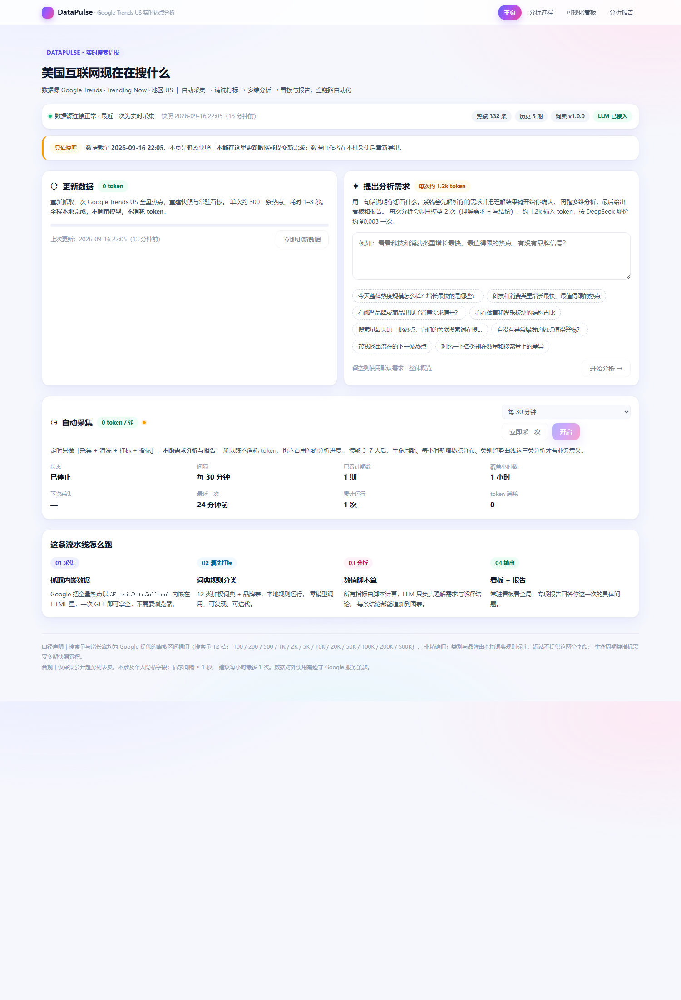

# 搜索引擎热点趋势分析 · DataPulse

一个「自动采集 → 清洗打标 → 自然语言提问 → 多维分析 → 可视化看板 / 分析报告」的
完整数据产品。**已经跑通，不是设计稿。**

- **数据源**：Google Trends Trending Now，地区 US
- **技术栈**：Python（仅标准库，零第三方依赖）· DeepSeek（LLM，可选增强）· 原生 HTML/JS + ECharts
- **在线演示**（只读快照）：<https://us-trend-pulse.app.workbuddy.host/>

## 效果预览

| 首页 · 更新数据 + 一句话提问 | 分析过程 · AI 把你的需求理解成了什么 |
|---|---|
|  |  |

| 可视化看板 · 10 组图表可交互 | 分析报告 · 7 章成文可导出 |
|---|---|
|  |  |

---

## 30 秒跑起来

**双击 `start.bat`** 就能用：它会启动本地服务并自动打开浏览器。

或者手动来：

```bash
python server.py          # 依赖：仅 Python 标准库，无 pip install
```

然后浏览器打开 **http://127.0.0.1:8848/**

首页 → 点「刷新数据」或输入一句需求 → 看分析过程 → 进看板 / 报告。

> **关于 `data/`：** 仓库里**不包含**它 —— 那是采集与分析的产物，会随每次运行不断变化。
> 所以刚 clone 下来首次打开时，页面可能提示还没有数据。点一下首页的「更新数据」，
> 约 2 秒后看板与报告就全部就绪，**这一步不消耗任何 API 额度**（采集链路不调用 LLM）。

> ### ⚠️ 不要双击文件夹里的 .html 文件
>
> 直接双击 `index.html` 会以 `file://` 打开，页面**取不到数据、渲染不出来**——
> 你会看到一个空壳。四个页面都要通过上面的本地服务地址访问，因为数据来自
> `server.py` 提供的 `/api/*` 接口，没有服务进程就没有数据。
>
> 记住这个地址即可：**http://127.0.0.1:8848/**
> 服务不开着的时候页面会提示「无法连接」，把 `start.bat` 双击起来就行。

服务默认监听 `127.0.0.1:8848`，只对本机可见，不对外暴露。换端口：

```bash
python server.py --port 9000
```

---

## 分享给别人看（静态快照 → 在线链接）

**`127.0.0.1` 只有你自己能打开，这不是故障。** 它叫「本机回环地址」——
全世界每一台电脑上都有一个 `127.0.0.1`，都指向**自己的**电脑。
所以朋友访问时，看到的是他自己电脑上的 8848 端口，自然什么都没有。

想让别人也看到，就把数据导出成一个**纯静态、只读**的快照站，
再挂到公网能到达的地方。

### 三步

```bash
python export_static.py                     # ① 导出到 dist/（需要先跑着 server.py）
python -m http.server 8899 --directory dist # ② 本地预览确认
python tests/verify_static.py               # ③ 无头浏览器逐页验证（推荐，能拦住"文件写对了但页面空白"）
```

`dist/` 就是最终产物。丢到任意静态托管（自己的服务器 / GitHub Pages / Vercel /
对象存储）都能直接跑，也可以 iframe 嵌进已有的个人主页：

```html
<iframe src="https://你的域名/datapulse/index.html"
        style="width:100%;height:900px;border:0"></iframe>
```

> 产物全部用**相对路径**，放域名根目录或子目录都不会断链 —— 导出脚本里的路径体检会拦住这种情况。

### 产物里有什么，没有什么

| 有 | 没有 |
|---|---|
| 四个页面 + 样式 + 图表库（已本地化，不再依赖 CDN） | **你的 API 密钥**（`config/llm.env` 不会被复制） |
| 数据快照 JSON（`dist/api/*.json`） | 任何可执行代码、任何写操作入口 |
| 首页「只读快照」横幅 + 数据时点 | 原始采集数据、历史快照 |

导出脚本会做三项体检，任一项不过就以非 0 退出码结束：

- **安全体检** —— 产物里不许出现 `.env` / `.py` / 原始数据文件
- **取数体检** —— `/api/*` → `api/*.json` 的改写确实装上了（漏了页面会整片空白）
- **路径体检** —— 没有残留的根路径引用（有的话换个目录部署就断链）

### 访客看到的和你看到的不一样

静态版里「更新数据」「开始分析」「自动采集」的按钮**是灰的、不可点**，
首页顶部显示「只读快照 · 数据截至 X」。这是故意的：
静态站没有后端，留一个能点的按钮只会让人点了没反应、以为坏了。



仓库里的 `dist/` 就是一份可直接部署的产物，`.github/workflows/pages.yml` 已经配好
推到 `main` 即自动发布到 GitHub Pages（仓库设置里把 Pages 的源选成 **GitHub Actions** 即可）。

### 已发布的线上链接

### https://us-trend-pulse.app.workbuddy.host/

实测确认：**线上是发布时的独立拷贝，不是从本地 `dist/` 实时读取的。**
所以在本机看到新数据 ≠ 线上也是新数据 —— 两者会各自独立。

**要更新线上数据**（三步，缺一不可）：

```bash
python server.py                     # ① 本机服务在跑
python src/scheduler.py --once       # ② 采集一次（或直接在首页点「更新数据」）
python export_static.py              # ③ 重新导出 dist/
# ④ 再把 dist/ 重新发布一次（重新发布之前，线上仍是旧快照）
```

判断线上是不是旧的：对比 `dist/api/dashboard.json` 与
`https://us-trend-pulse.app.workbuddy.host/api/dashboard.json` 的哈希是否一致。

> 为什么不做成实时同步？因为那需要一台 7×24 在线的服务器，并且访问者能碰到你的
> API 额度。上传独立拷贝的代价只是「数据是快照」，但换来的是零风险、零运维。

---

## 四个页面

| 页面 | 路径 | 做什么 |
|---|---|---|
| 主页 | `/` | 「更新数据」按钮 + 需求输入框 + 数据源状态 |
| 分析过程 | `/analysis` | 展示 AI **把你的需求理解成了什么**，六阶段实时进度与日志 |
| 可视化看板 | `/dashboard` | 10 组图表，筛选器实时重算；可交互钻取 |
| 分析报告 | `/report` | 按需求成文的 7 章报告，可打印/导出 PDF |

截图见文首「效果预览」（源文件在 `demo/shots/`）。

---

## 六个阶段

```
采集 → 清洗质检 → 分类打标 → 指标计算 → 需求分析 → 报告
```

阶段之间**只通过文件通信**，所以任一阶段可单独重跑，中断后可恢复：

| 阶段 | 产物 |
|---|---|
| 采集 | `data/snapshots/snapshot_US_24h_<时刻>.jsonl` |
| 清洗质检 | `data/quality.json`、`data/latest.json` |
| 分类打标 | 写入 `latest.json` / `data/dim_trend.jsonl` |
| 指标计算 | `data/dashboard.json` |
| 需求分析 | `data/analysis.json` |
| 报告 | `data/report.json`、`data/reports/report_<时刻>.json` |

进度写 `data/status.json`，分析过程页每秒轮询它 —— 所以刷新不丢进度。

这条流水线有**两个入口**，区别只在于后两步跑不跑：

| 入口 | 跑到哪 | 用途 | 消耗 token |
|---|---|---|---|
| `run_pipeline()` | 全部 6 阶段 | 用户提问 | 约 1.2k |
| `run_collect_only()` | 只到阶段 4 | 「更新数据」按钮、定时采集 | **0** |

后两步（需求分析、报告）是唯一调用模型的地方。前四步全部在本地完成，
所以「更新数据」和「定时采集」可以随便点、随便跑，不花一分钱。

---

## 两条设计红线

**1. 数值一律脚本算，LLM 只负责理解与解释。**

LLM 只出现在两个位置：把中文需求转成结构化 `filters/focus`，以及在**已算好的数字**上
写执行摘要与建议（prompt 里明确禁止引入新数字）。报告里每条结论都带
`evidence`，指向某个图表 ID 或 `trend_id`，可点回看板核对。

没配 LLM 密钥也能用 —— 需求理解自动降级为本地规则解析器，结论走模板生成，
功能不缩水，页面会标注「本地规则理解」。

**2. 采集失败必须降级，不能假装成功。**

线上抓取失败时自动改用最近快照，页面挂「缓存数据」黄色徽章 + 日志说明原因，
而不是静默返回空数据。（这个能力在实测中真的被触发过，见 `FEASIBILITY.md`。）

---

## 目录

```
server.py                 零依赖本地服务 + 全部 API
index/analysis/dashboard/report.html
assets/theme.css          鲜亮配色主题
assets/common.js          公共脚本（请求/格式化/图表封装/轮询）

export_static.py          静态快照导出器（把活服务导出成只读静态站）
dist/                     导出产物（可直接上传/发布，每次导出会重建）

src/
  pipeline.py             六阶段编排 + 进度落盘（含「只采集」路径）
  scheduler.py            定时采集 + 开关 + 基线重建
  gt_collect.py           采集器（解析 HTML 内嵌 ds:0 数据块）
  classify.py             加权打分词典打标引擎
  analyze.py              需求解析 + 多维分析 + 结论生成
  report.py               报告组装
  llm.py                  LLM 适配层（预设 / 可降级 / 自检）
  build_demo.py           单页看板导出器（旧 demo，保留）

config/
  taxonomy.json           12 类加权词典 + 43 品牌表 + 消费子类（本文件是核心资产）
  sources/google-trends-us.json   数据源配置（含降级通道）
  llm.env.example         LLM 密钥配置模板（复制成 llm.env 即可用）

tests/
  test_llm_path.py        LLM 通道集成测试（本地 mock 端点，8 场景 36 项断言）
  e2e_real.py             真实密钥端到端验证（跑完整分析并打印模型输出）
  health.py               服务与全部路由探活
  shoot.py                无头 Chrome 页面截图
  verify_static.py        纯静态环境下的逐页渲染验证（无后端，剥脚本后断言）
  measure_tokens.py       token 消耗实测（截获真实 prompt）
  probe_models.py         列出服务商可用模型 + 探测 max_tokens 是否够
  _tmpdata/               测试隔离目录（产物，可随时删）

data/                     运行时产物
```

### API

| 路由 | 说明 | 消耗 token |
|---|---|---|
| `GET /api/meta` | 数据集、引擎、调度状态 | — |
| `GET /api/status` | 流水线实时进度（分析过程页轮询） | — |
| `GET /api/dashboard` `/api/analysis` `/api/report` `/api/quality` `/api/dataset` | 各类产物 | — |
| `GET /api/schedule` `/api/schedule_state` | 调度状态与进度 | — |
| `POST /api/collect` | 「更新数据」按钮：采集+重建看板 | **0** |
| `POST /api/analyze` | 完整分析（需求解析 + 报告） | 约 1.2k 输入 |
| `POST /api/schedule/start` `/stop` `/run-once` | 定时采集开关与手动触发 | **0** |

---

## 分类词典

`config/taxonomy.json` 是**LLM 依据真实抓取样本构建、可人工迭代**的词典，
本地规则执行，零模型调用。

改词典 → `python src/classify.py --samples` 看标注质量 → 
`python src/classify.py --relabel` 回刷已有数据。

实测：299 条样本中未归类（Other）从 **77.9% 降到 13.4%**，品牌识别从 5 个升到 16 个。

> ⚠️ **但 13.4% 是「样本内」成绩，别当成线上真实水平。**
> 那 299 条正是 LLM 用来构建词典的样本，对它当然拟合得好。
> 用同一份词典回刷**线上新采集**的数据（330–333 条），未归类率是 **20.4% ~ 23.2%**，
> 与样本内相差约 **9.8 个百分点** —— 存在明显的泛化差距。
>
> 以后对外描述分类效果时，**请引用样本外的数字**（当前 ≈23%），
> 或者明确写「样本内 13.4% / 样本外 23.2%」。两者都好，混淆了就站不住。
>
> 想自己复核：
> ```bash
> python src/classify.py --samples          # 看当前数据集的真实未归类率
> ```
> 归档里的 `_archive_20260916T213116/snapshot_*174002.jsonl` 就是那份 299 条样本。

---

## 配 LLM（可选，不配也能完整运行）

**最快的方式**：把 `config/llm.env.example` 复制成 `config/llm.env`，填两行即可：

```
OPENAI_PROVIDER=deepseek
OPENAI_API_KEY=sk-你的密钥
```

`base_url` 与 `model` 由内置预设自动填好，不用手写。然后自检：

```bash
python src/llm.py
```

它会打印当前配置并**真发一次调用**，明确告诉你密钥能不能用。

### DeepSeek 用户必读

```bash
export OPENAI_PROVIDER=deepseek     # base_url 与 model 走预设
export OPENAI_API_KEY=sk-xxx
```

| 项 | 值 |
|---|---|
| 端点 | `https://api.deepseek.com/v1` |
| 模型 | `deepseek-flash`（当前官方模型） |
| JSON 输出 | 支持，代码已适配 |

> ⚠️ **不要再用 `deepseek-chat` / `deepseek-reasoner`** —— 这两个旧别名已于
> **2026-07-24 下线**，调用会直接失败。网上大量教程仍在用，别照抄。
> 模型名迭代频繁，长期使用请以官方定价文档为准。

#### `deepseek-flash` 是推理型模型，别把 `max_tokens` 给小

它返回的 JSON 里除了 `content` 还有一个 `reasoning_content`（思维链），
**思维链同样计入 `max_tokens`**。预算给小了会出现这种迷惑结果：

```
content = ""            ← 正文一个字都没有
finish_reason = "length"
usage.completion_tokens = 20   ← 全花在思考上
```

看起来像密钥失效或模型不听话，实际只是预算被思考吃光了。

代码里已经处理了两层：需求解析给 1200、报告叙述给 4000；万一还被吃光，
会**自动把预算翻倍重试一次**（`status()` 里的 `last_retry_reason` 会写明原因）。
自检 `python src/llm.py` 也是按这个逻辑跑的，所以它不会再误报密钥有问题。

排查服务商怪问题时可以用：

```bash
python src/llm.py --raw          # 打印思维链预览
python tests/probe_models.py     # 列出该服务商可用模型 + 探测预算是否够
```

内置预设还覆盖 `openai` / `dashscope` / `moonshot` / `zhipu` / `siliconflow`；
其他服务商直接写 `OPENAI_BASE_URL` + `OPENAI_MODEL` 即可。

### token 消耗（实测，非估算）

用本地 mock 端点截获真实 prompt 量出来的：

| 操作 | 模型调用 | 输入 token | 输出 token |
|---|---|---|---|
| **定时采集**（每小时一次） | **0 次** | **0** | **0** |
| 「更新数据」按钮 | **0 次** | **0** | **0** |
| 提一个问题（完整分析） | 2 次 | 约 **1.2k** | 约 **0.4k** |

原因是**采集、清洗、打标、指标全部在本地完成**——类别判断走
`config/taxonomy.json` 词典（不是让模型逐条分类），所以定时跑一年 8760 次也是 ¥0。

单次提问按 DeepSeek `deepseek-flash` 现价算约 **¥0.003**（空闲时段），
一天问 100 次约 ¥0.3。想自己复测就跑 `python tests/measure_tokens.py`。

### LLM 路径怎么验证

**不需要密钥的（管道验证）**：

```bash
python tests/test_llm_path.py        # 起本地 mock 端点，跑真实流水线
```

覆盖 8 个场景：正常返回 / ```json 围栏 / 返回非 JSON / 上游 500 / 响应超时 /
服务商拒绝 `response_format`（自动去掉该参数重试）/
**推理模型思维链吃光预算（自动放大预算重试）** / **上游持续返回空正文**。
后六种都必须降级且**不中断流水线**。当前 **36/36 通过**。

> 这些测试会真实跑完整流水线。它们**不会碰你的 `data/` 目录** ——
> 产物全写在 `tests/_tmpdata/`，跑完可以随便删。
> （早期版本没做隔离，跑一次测试就会把真实分析结果覆盖成 mock 内容，
> 已修复；脚本里还留了一道安全闸，隔离失效就直接中止而不是继续跑。）

**需要密钥的（真实输出质量）**：

```bash
python src/llm.py                    # 配置 + 真实连通性自检
python tests/e2e_real.py             # 通过服务跑一次真实分析，打印模型输出
python tests/health.py               # 逐个探活所有页面与 API 路由
python tests/shoot.py                # 无头 Chrome 给四个页面截图
```

---

## 自动采集（解锁生命周期分析）

定时采集是**生命周期、每小时新增热点分布、类别趋势曲线**这三类分析成立的前提。

**方式一：页面上点一下**（推荐）。主页「自动采集」卡片可以选间隔并一键开启，
服务进程内启动后台线程，页面每 30 秒自刷状态。

> ⚠️ **开关状态不持久化，重启服务后不会自动恢复。**
> 采集线程是 `server.py` 进程内的 `daemon` 线程（`scheduler.start_in_thread()`），
> 所以：**关掉服务 = 定时采集也停了**，而且下次启动不会自动接着跑，要重新点一次开关。
> 想让采集独立存活于服务重启，用下面方式二或方式三。
>
> 判断当前有没有在跑：`python src/scheduler.py --status`，或看
> `http://127.0.0.1:8848/api/meta` 里的 `schedule.running`。
> 注意 `data/scheduler.json` 里的 `interval_minutes` 是**上次用过的偏好值**，
> 不代表开关是开的 —— 以 `running` / `next_run_at` 为准（`next_run_at: null` 就是没在跑）。

**方式二：独立进程**

```bash
python src/scheduler.py                # 前台跑，默认每小时
python src/scheduler.py --interval 30  # 每 30 分钟（最小 15）
python src/scheduler.py --status       # 只看状态
python src/scheduler.py --once         # 只采一次，配合系统计划任务
```

**方式三：Windows 计划任务 / cron**，用 `--once` 让操作系统负责调度，最稳。

它**不做**的事（这是刻意的）：

- 不跑需求解析与报告 → 所以 token 恒为 0
- 不覆盖 `data/status.json` → 不会打断你正在看的分析进度（进度写 `data/schedule_state.json`）

安全阀：最小间隔 15 分钟、每轮请求间隔 ≥ 1 秒、每日上限默认 30 次、失败自动降级到本地快照。

> **首次启用前建议重建基线。** 开发测试期间往往几分钟内连采多次，这些快照
> 时间间隔不等且极短，会让 `duration` / `persistence` 失去业务意义。
> `python src/scheduler.py --reset-history` 会把旧快照**归档**（不是删除，
> 移到 `data/snapshots/_archive_<时间戳>/`）并立刻采一次新基线。

---

## 验证状态

| 项 | 状态 |
|---|---|
| 采集（实时） | ✅ 325–333 条 / 1.1–2.2 秒 / `source=live` |
| 六阶段流水线 | ✅ 全绿，总耗时约 2 秒 |
| 分类词典 | ✅ 样本内 Other 77.9% → 13.4%；**样本外（线上）≈23%**，泛化差距 9.8pp |
| 四个页面渲染 | ✅ 无头 Chrome 实际渲染 |
| 15 个 API 路由 | ✅ 全部 200 |
| 并发竞态（30ms 高频轮询） | ✅ 已修复并复现验证 |
| 「更新数据」走零 token 路径 | ✅ 步骤 1–4 完成、5–6 跳过，需求文本未被覆盖 |
| 定时采集（开关 / 单次 / 停止） | ✅ 接口与线程均验证，`llm_calls = 0` |
| LLM 代码路径 | ✅ mock 端点 36/36（含 response_format 降级、思维链吃光预算自动重试） |
| token 消耗实测 | ✅ 单次提问约 1.2k 输入，采集 0 |
| **LLM 真实模型输出质量** | ✅ 已用真实密钥验证：需求解析正确、报告数字零编造、可执行建议 |
| 服务重复启动保护 | ✅ 端口被占用时明确提示并退出，不再出现双实例抢端口 |
| **静态快照导出** | ✅ 三项体检全过；纯静态环境（无后端）下四页均渲染正常 |
| **在线发布** | ✅ 已上线并实测：首页/看板/报告线上渲染正常、echarts 本地加载 |
| 生命周期指标的业务意义 | ⚠️ 未验证（需等间隔采集 3–7 天） |

细节与踩坑过程见 `BUILD.md`。

---

## 其他文档

| 文件 | 用途 |
|---|---|
| `BUILD.md` | **本次交付与验证报告**：实测数字、踩到的两个真实 bug、验证边界 |
| `FEASIBILITY.md` | 数据源可行性验证：字段映射、3 个数据缺口、受限网络行为 |
| `PRD.md` | 产品需求文档：功能需求、数据契约、里程碑 |
| `PROMPTS.md` / `SKILLS.md` | 若要改造成 Agent/Skill 形态的可执行 Prompt 与技能全文 |
| `RESOURCES.md` | 连接器 / 专家 / 内置技能选型参考 |

---

## 数据口径（重要）

- 搜索量是 **12 档区间桶值**（100 / 200 / 500 / 1K / 2K / 5K / 10K / 20K / 50K / 100K / 200K / 500K），
  不是精确次数。「搜索量合计」只能读作量级参考。
- 增长率同样是离散档位（50/75/100/…/1000）。
- `category` / `brand` / `status` **源站都不提供**：类别与品牌由本地词典标注，
  status 由历史快照比对判定。
- 生命周期类指标（duration / persistence / 每小时新增）需要多期快照累积。
  **`persistence` 的单位是「采集批次」，不是小时** —— 只有固定等间隔采集（建议每小时 1 次）
  时它才等价于「持续小时数」。手动零散触发会让这个数偏大。
- 品牌热度衡量的是**搜索关注度，不是销量**。

---

## 合规

仅采集公开趋势列表页，不涉及个人隐私字段；请求间隔 ≥ 1 秒，建议每小时最多 1 次。
数据对外使用需遵守 Google 服务条款，商用前请自行确认授权范围。
